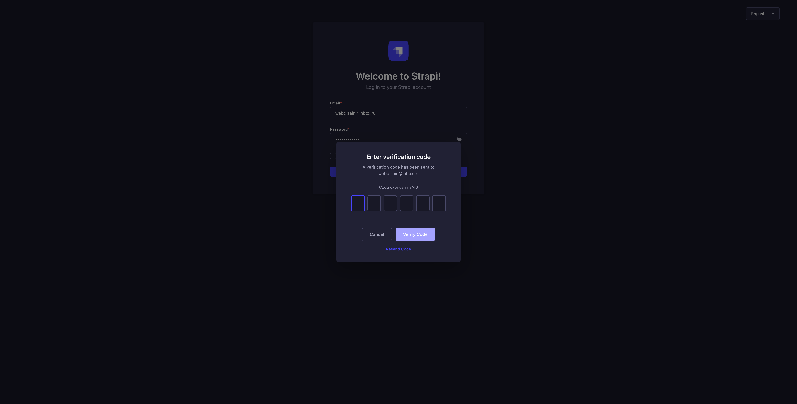
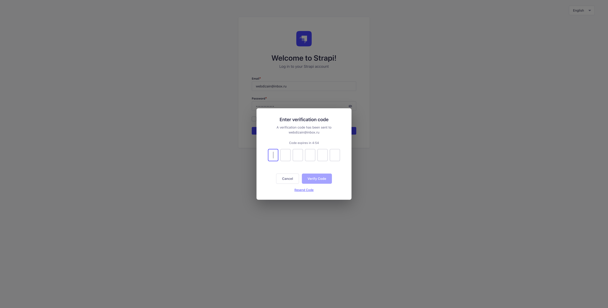

# strapi-plugin-admin-2fa-by-email

Two-factor email authentication for Strapi 5 admin panel.

## Screenshots

| Dark theme | Light theme |
|:---:|:---:|
|  |  |

## Features

- Email-based two-factor authentication for admin login
- OTP code generation and verification
- Configurable code length, expiration time, and max attempts
- Automatic dark/light theme detection
- Localization support (English, Russian)
- Works with any Strapi email provider (nodemailer, sendgrid, etc.)
- Automatic cleanup of expired codes

## Installation

```bash
npm install strapi-plugin-admin-2fa-by-email
# or
yarn add strapi-plugin-admin-2fa-by-email
```

## Configuration

Add the plugin to your Strapi configuration in `config/plugins.ts`:

```typescript
export default () => ({
  'admin-2fa-by-email': {
    enabled: true,
    config: {
      codeLength: 6,
      codeExpiration: 5, // minutes
      maxAttempts: 3,
      emailSubject: 'Your verification code',
    },
  },
});
```

### Configuration Options

| Option | Type | Default | Description |
|--------|------|---------|-------------|
| `codeLength` | `number` | `6` | Length of the OTP code |
| `codeExpiration` | `number` | `5` | Code expiration time in minutes |
| `maxAttempts` | `number` | `3` | Maximum verification attempts before code is invalidated |
| `emailSubject` | `string` | `'Your verification code'` | Subject line for the verification email |

## Requirements

- Strapi v5.0.0 or higher
- A configured email provider in Strapi

## How it works

1. User enters email and password on the Strapi admin login page
2. Plugin intercepts the login request and validates credentials
3. If credentials are valid, a verification code is sent to the user's email
4. User enters the code in the modal dialog
5. If the code is correct, the user is logged in

## License

MIT
